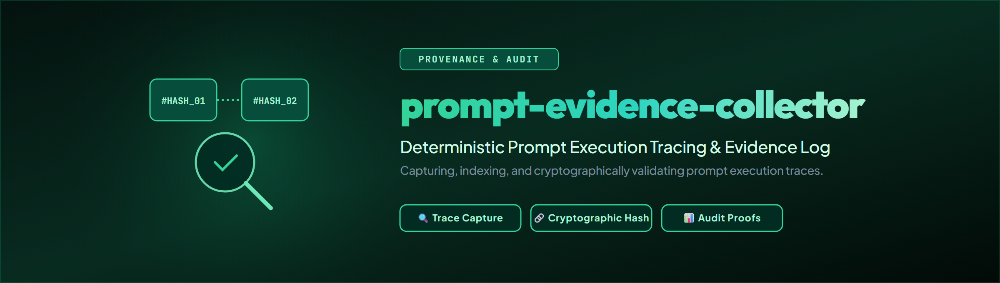

# prompt-evidence-collector

[](README.md)
[](README_de.md)
[](https://docs.pytest.org/)
[](https://www.python.org/)
[](LICENSE)
[](https://github.com/ellmos-ai)
[](https://github.com/open-bricks)

> [!NOTE]
> **LLM / AI Context File Available**: For an AI-optimized machine-readable architectural summary of this repository, inspect [`llms.txt`](file:///llms.txt).

Eigenständiges, cloud-sicheres Prompt-/Workflow-Evidenz-Modul (aus `ellmos-core` extrahiert).

Der Collector speichert Rohtext **ausschließlich lokal** (App-eigener
Local-Data-Root, gehärtete Verzeichnisrechte) und projiziert nach außen nur
gehashte Receipts — niemals Rohtext, niemals automatisch in eine Bibliothek
oder eine Nutzerentscheidung (Vertrag V4-08).

- Raw-Store: `<local-app-data>/prompt-evidence-collector/prompt-evidence/`
- Fail-closed bei unsicheren Stores, fehlender oder mehrdeutiger Evidenz und
  Integritätsbrüchen
- Standardmäßig deaktiviert gedacht: keine Hintergrundläufe, keine Scheduler,
  keine Netzwerkzugriffe
- Feste interne Clutch-Resolver-Registry: kein vom Aufrufer einschleusbarer
  Live-Resolver
- Autorisierter Live-Pfad: signierter one-shot CaptureGrant, privater
  Trust-Store, immutable Resolver-Receipt und atomarer SQLite-Replay-Schutz

Status: Extraktion aus `ellmos-core@03f6f58` (Service
`ellmos_core.services.prompt_evidence`), Code unverändert bis auf den
Store-Namespace (`APP_DIR = "prompt-evidence-collector"`). Die
ellmos-core-Fassung bleibt vorerst bestehen; ein Cutover ist ein eigener,
gegateter Schritt.

## Autorisierter one-shot Capture

```python
result = collector.authorize_and_capture_from_locator(
    locator=clutch_locator,
    grant=signed_capture_grant,
    resolver_runtime_receipt=signed_runtime_receipt,
)
```

Dieser Pfad prüft vor dem ersten Resolveraufruf:

- Ed25519-Signatur gegen den privaten lokalen Trust-Store
- exakten Provider-, Locator-, Hash-, Zweck- und Aufbewahrungsscope
- höchstens eine Stunde Grant-Laufzeit, `one_shot=true`, `max_captures=1`
- signiertes immutable Resolver-Receipt sowie Modul, Export, Callable- und
  Adapter-Hash des intern registrierten Resolvers
- atomare Reservierung im privaten SQLite-Ledger; `prepared` ist ausschließlich
  idempotent recoverbar, `consumed` und `failed` sind terminal

Das zusätzliche Consumption-Receipt ist cloud-sicher und enthält nur Codes,
opaque IDs und Hashes. Promotion bleibt zwingend `not-reviewed`.

Zulässige Autoritätsquellen sind eine explizite Nutzerentscheidung, eine
explizite Capture-Policy oder ein delegierter Decision Avatar. Ein
Decision-Avatar-Grant gilt jedoch nur, wenn Policy Registry dessen Signierschlüssel
und Scope im lokalen Trust-Store freigegeben hat. Eine TOM_lm-Prognose oder ein
caller-supplied Claim allein autorisiert nichts. Die früheren Low-Level-
Capture-Methoden sind nicht Teil der öffentlichen Collector-API.

Live-Aktivierung, Trust-Key-Provisionierung und der ellmos-core-Cutover bleiben
eigene gegatete Schritte; standardmäßig arbeitet das Modul passiv.

## Explicit curated gate and storage integrity

Every capture API rejects `rejected`, `candidate`, and `curated` promotion
statuses. Captures persist as `not-reviewed`; promotion is a separate local
`PromptEvidenceCollector.transition_promotion(...)` operation. It requires a
`PromotionGate` (`ellmos.prompt-evidence-promotion-gate.v1`) containing the
opaque evidence ID, source/target status, one of the explicit authority source
codes, an authorization reference, a UTC timestamp, and a self-bound `pg-<sha256>`
gate ID. Allowed transitions are `not-reviewed -> rejected|candidate` and
`candidate -> rejected|curated`; terminal states cannot be promoted again.
Missing, malformed, stale, or repeated conflicting gates fail closed with
`PromotionGateError`. A successful transition preserves the existing receipt
schema, evidence ID, content hash, and raw object; only a hash-/ID-only audit
receipt is written under the private local store. No network, provider hook, or
raw-text projection is involved.

Raw content has an explicit byte contract: the API accepts a non-empty Python
string, encodes it strictly as UTF-8, hashes those exact bytes, and writes and
reads the bytes without newline normalization. LF, CRLF, mixed line endings,
trailing newlines, and Unicode therefore round-trip identically on Windows and
POSIX. A changed byte or invalid UTF-8 read fails with
`EvidenceIntegrityError`.

Raw and evidence receipt publication uses a private pair protocol. Durable
temporary files are written inside their bound directories, flushed and synced,
then published with no-overwrite links. A hash-/ID-only pair manifest is
committed last; a pending marker and leftover temporary/orphan objects are
never auto-deleted. `prompt-evidence-collector doctor` inventories these
objects and returns exit code `3` for an incomplete or invalid pair, so no
half-published pair is treated as valid evidence.

Doctor emits the stable `ellmos.prompt-evidence-collector-doctor.v3` schema
with `status`, `code`, `exit_code`, fully pair-validated `receipt_count`
(`structural_receipt_count` is exposed separately), complete and incomplete
pair counts, and counts for invalid receipts, mismatches, orphans,
pending/temp files, unknown objects, and reparse objects. It never includes raw
content or provider URIs; an invalid store is reported with exit code `3` and
is never repaired automatically.

## Read-only authorization preflight

The CLI can inspect the already existing canonical private app store without
creating files or accepting a caller-selected trust root:

```bash
python -m prompt_evidence_collector.cli authorization-preflight
python -m prompt_evidence_collector.cli authorization-validate \
  --grant capture-grant.json \
  --runtime-receipt resolver-runtime-receipt.json
```

`authorization-preflight` validates the canonical store binding, ACL/mode,
reparse/symlink boundaries, trust-store schema, key fingerprints, roles,
authority scopes, and validity windows. On Windows the store root, trust
directory, and trust file must have a private owner/ACL; on POSIX their modes
must be private. POSIX discovery is bound to the native account home from the
OS account database; redirected `HOME` or `XDG_DATA_HOME` values fail closed.
`authorization-validate` additionally
checks the CaptureGrant and immutable runtime-receipt structures, both Ed25519
signatures, TTLs, authority scope, and the exact signed grant-to-runtime hash
binding.

The read-only commands output only stable codes, hashes, scope, TTL, and status.
They never output paths, public-key values, signatures, or raw content. They do
not import or execute resolver code, resolve a locator, read back a live runtime,
touch the replay ledger, capture evidence, call hooks, or use the network. A
valid result therefore proves the signed runtime receipt and its grant binding,
not the presence or health of the referenced resolver runtime.

Grant and runtime-receipt inputs must be bounded (maximum 1 MiB), regular,
single-link files on a fixed local drive. Symlink/reparse, UNC/remote, and known
cloud/sync paths are rejected before content is opened, preventing hydration or
network reads.

Stable exit codes are: `0` valid, `2` invalid input, `3` invalid/unavailable
private trust store, `4` invalid signature, `5` expired/not-current, and `6`
scope or binding mismatch. Currentness always uses the host's current UTC clock;
the CLI does not accept a caller-selected validation time.

## Fail-closed trust enrollment

Version 0.4 adds a separate plan/apply path for enrolling capture-authority and
runtime-release **public keys**:

```bash
python -m prompt_evidence_collector.cli trust-enroll plan \
  --proposal trust-proposal.json
python -m prompt_evidence_collector.cli trust-enroll apply \
  --proposal trust-proposal.json \
  --activation signed-trust-activation.json \
  --expected-plan-sha256 <sha256>
```

`plan` is deterministic and read-only. Its output contains fingerprints and
bounded scope codes, but no paths, public-key values, signatures, or private
material. `apply` never accepts a caller-selected trust root. It requires an
Ed25519 activation, bound to `D-20260731-004`, the exact host/system, proposal,
plan hash, and validity window, signed by an issuer already pinned in the fixed
private file `bootstrap/trust-activation-authorities.v1.json` below the canonical
app store.

The resulting V2 trust store enforces provider, purpose, sensitivity,
retention, one-shot cardinality, and maximum Grant TTL. Publication uses an
atomic no-overwrite operation with ACL/mode and hash readback. It creates no
capture ledger, evidence, receipts, hooks, scheduler, or network activity.
Before the first capture state exists, `trust-enroll rollback
--expected-trust-sha256 <sha256>` can remove the exact unchanged enrollment.
After any evidence or Grant state exists, keys must be retired by a signed
revision; evidence and ledgers are never deleted by rollback.

The module does not generate, store, or rotate private keys and cannot
self-bootstrap its issuer. Provisioning the fixed bootstrap trust file remains
an external system-authority/key-custody responsibility. No live trust is
created merely by installing this version.

## Bundle and partners

This module is the recommended private evidence component of
`ellmos-prompt-workflow-bundle` (profile `capture`). The bundle manifest in the
`ellmos-development-system` repository is authoritative for membership and
compatible versions. Direct partners are:

- required workflow and context gates: `WORKFLOWHOOKER`, `memory-hooker`;
- curated library authority: `ellmos-core`;
- optional local locator/session producer: `clutch`;
- optional personalized method: `build-your-users-mind`;
- recommended extraction/hygiene skills: `workflow-extract`,
  `skill-extractor`, `llm-text-hygiene`;
- optional clients: ProfiPrompt and PromptBoard.

The collector remains independently installable. Bundle membership does not
transfer prompt-library, policy, decision, user-model, or private-key authority
to this module.

## Entwicklung

### CI- und Release-Parität

`.github/workflows/ci.yml` führt für Python 3.11 und 3.12 auf Ubuntu, Windows
und macOS denselben reproduzierbaren Ablauf aus: Installation mit
`pip install -e ".[dev]"`, Ruff, Pytest mit sichtbaren Plattform-Skips (`-ra`)
und einen passiven `doctor`-Smoke. Der Windows-Lauf aktiviert die Known-Folder-
und ACL-Pfade; POSIX-Läufe prüfen private Modi und Reparse-Grenzen. Kein
Matrixjob startet Capture, Netzwerk oder Cutover.

Die einzige Versionsquelle ist
`src/prompt_evidence_collector/_version.py`. `pyproject.toml` leitet seine
Build-Version daraus ab; Paketimport und `ellmos-module.v2.json` werden durch
`tests/test_release_parity.py` gegengeprüft.

```bash
pip install -e .
python -m pytest -q
```
