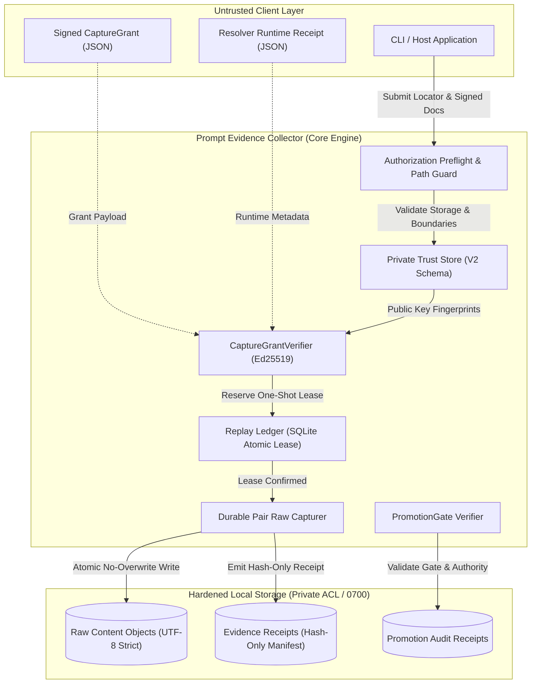
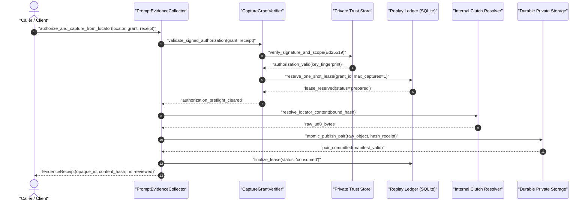

# prompt-evidence-collector

[](README.md)
[](README_de.md)
[](pyproject.toml)
[](https://www.python.org/)
[](tests/)
[](tests/)
[](https://github.com/astral-sh/ruff)
[](LICENSE)
[](SECURITY.md)
[](SECURITY.md)
[](pyproject.toml)
[](https://github.com/ellmos-ai)
[](https://github.com/open-bricks)
[](llms.txt)

<p align="center">
  <b><a href="#systemarchitektur-und-sicherheitsgrenzen">Architektur</a></b> •
  <b><a href="#autorisierter-erfassungs--und-verifikationsablauf">Workflow</a></b> •
  <b><a href="#laufzeit-invarianten">Invarianten</a></b> •
  <b><a href="#installation">Installation</a></b> •
  <b><a href="#autorisierter-one-shot-capture">Schnellstart</a></b> •
  <b><a href="#schreibgeschützter-autorisierungs-preflight">CLI-Preflight</a></b> •
  <b><a href="#fail-closed-trust-enrollment">Trust-Enrollment</a></b> •
  <b><a href="#bundle-und-partner">Ökosystem</a></b>
</p>

> [!NOTE]
> **LLM-/KI-Kontextdatei vorhanden:** [`llms.txt`](llms.txt) enthält die
> maschinenlesbare Zusammenfassung von Architektur und Grenzen.

Eigenständiges, cloud-sicheres Prompt- und Workflow-Evidenzmodul, das aus
`ellmos-core` extrahiert wurde. Es speichert Rohtext ausschließlich in einem
gehärteten, anwendungseigenen lokalen Datenverzeichnis und gibt nur gehashte
Receipts aus. Rohtext wird weder hochgeladen noch automatisch in eine
Bibliothek, Policy oder Nutzerentscheidung übernommen.

- Rohdatenspeicher: `<local-app-data>/prompt-evidence-collector/prompt-evidence/`
- Fail-closed bei unsicherem Speicher, mehrdeutiger Evidenz oder Integritätsbruch
- Standardmäßig passiv: kein Dienst, Scheduler, keine Telemetrie und kein Netzwerkzugriff
- Feste interne Clutch-Resolver-Registry; Aufrufer können keinen Live-Resolver einschleusen
- Autorisierter Capture mit signiertem One-shot-`CaptureGrant`, unveränderlichem
  Runtime-Receipt, privatem Trust-Store und atomarem SQLite-Replay-Schutz

Die Extraktion basiert auf `ellmos-core@03f6f58`. Die ursprüngliche
Implementierung bleibt bestehen, bis ein eigener, ausdrücklich autorisierter
Cutover abgeschlossen ist.

## Systemarchitektur und Sicherheitsgrenzen



## Autorisierter Erfassungs- und Verifikationsablauf



## Laufzeit-Invarianten

Die folgenden Invarianten werden über alle Betriebspfade hinweg formal geprüft und durchgesetzt:

| Invarianten-ID | Bereich | Durchsetzungsmechanismus | Fehlerverhalten |
|---|---|---|---|
| `INV-LOCAL-01` | Speicher-Privatsphäre | Rohtext verbleibt strikt im privaten App-Verzeichnis; externe Ausgaben sind reine Hash-Receipts | Fail-closed (`UnsafeEvidenceStoreError`) |
| `INV-LOCAL-02` | Egress-Isolation | Standardmäßig passiv: null Hintergrunddienste, null Scheduler, null Netzwerkzugriffe | Passive Architektur-Garantie |
| `INV-AUTH-03` | Autorisierung | Einmalige Erfassung (`max_captures=1`), max. 1 Stunde Gültigkeitsdauer, Ed25519-Signaturprüfung | `CaptureAuthorizationError` |
| `INV-AUTH-04` | Scope-Bindung | Exakte Übereinstimmung von Provider, Locator, Content-SHA-256, Zweck, Sensitivität und Retention | `CaptureAuthorizationError` |
| `INV-REPLAY-05` | Replay-Schutz | Atomares SQLite-Ledger mit zweiphasiger Lease-Reservierung (`prepared` $\to$ `consumed` / `failed`) | Terminale Ablehnung bei Duplikaten |
| `INV-PAIR-06` | Crash-Sicherheit | Dauerhaftes Paarprotokoll: Rohtext und Receipt atomar ohne Überschreiben geschrieben | `EvidenceIntegrityError` |
| `INV-GATE-07` | Status-Promotion | Begrenzte Übergänge (`not-reviewed -> candidate/rejected`, `candidate -> curated/rejected`) via `PromotionGate` | `PromotionGateError` |
| `INV-BYTE-08` | Byte-Genauigkeit | Exakte UTF-8-Byte-Prüfung ohne Zeilenumbruch-Normalisierung (LF, CRLF byte-identisch) | `EvidenceIntegrityError` |
| `INV-TRUST-09` | Trust-Enrollment | Deterministischer Read-only-`plan` und Ed25519-gebundenes `apply` gegen Bootstrap-Autorität | `TrustEnrollmentError` |
| `INV-SLA-10` | Schwachstellen-SLA | 48-Stunden-Reaktions-SLA und 5-Werktage-Triage-Zusage gemäß Sicherheitsrichtlinie | Definiert in `SECURITY.md` |

## Installation

Erforderlich ist Python 3.11 oder neuer. Die Installation allein provisioniert
keinen Trust, startet keinen Capture und erzeugt keine Hintergrundaktivität.

```bash
python -m pip install -e .
python -m prompt_evidence_collector.cli doctor
```

## Autorisierter One-shot-Capture

```python
result = collector.authorize_and_capture_from_locator(
    locator=clutch_locator,
    grant=signed_capture_grant,
    resolver_runtime_receipt=signed_runtime_receipt,
)
```

Vor dem ersten Resolveraufruf prüft dieser Pfad:

- die Ed25519-Signatur gegen den privaten lokalen Trust-Store;
- den exakten Provider-, Locator-, Hash-, Zweck-, Sensitivitäts- und Aufbewahrungsscope;
- höchstens eine Stunde Grant-Laufzeit, `one_shot=true` und `max_captures=1`;
- das signierte unveränderliche Resolver-Receipt einschließlich Modul-, Export-,
  Callable- und Adapter-Hash; und
- die atomare Reservierung im privaten SQLite-Ledger. `prepared` ist nur
  idempotent wiederherstellbar; `consumed` und `failed` sind terminal.

Das Consumption-Receipt enthält ausschließlich stabile Codes, opake IDs und
Hashes. Captures beginnen immer als `not-reviewed`. Zulässige Autoritätsquellen
sind eine explizite Nutzerentscheidung, eine explizite Capture-Policy oder ein
autorisierter delegierter Decision Avatar. Eine Prognose oder ein vom Aufrufer
behaupteter Claim allein autorisiert nichts.

Live-Aktivierung, Trust-Key-Provisionierung und Core-Cutover sind getrennte,
gegatete Vorgänge. Die Low-Level-Capture-Helfer gehören nicht zur öffentlichen API.

## Explizites Curated-Gate und Speicherintegrität

Jede Capture-API weist die vom Aufrufer gesetzten Promotionszustände `rejected`,
`candidate` und `curated` zurück. Promotion ist die getrennte lokale Operation
`PromptEvidenceCollector.transition_promotion(...)` und erfordert ein
selbstgebundenes `PromotionGate` mit opaker Evidence-ID, Quell- und Zielzustand,
expliziter Autoritätsquelle, Autorisierungsreferenz und UTC-Zeitpunkt.

Erlaubt sind `not-reviewed -> rejected|candidate` und
`candidate -> rejected|curated`. Fehlende, fehlerhafte, veraltete oder
widersprüchliche Gates scheitern fail-closed mit `PromotionGateError`. Eine
erfolgreiche Transition bewahrt Evidence-ID, Content-Hash, Receipt-Schema und
Raw-Objekt; ergänzt wird nur ein Audit-Receipt mit IDs und Hashes.

Für Rohinhalte gilt ein exakter Bytevertrag: Nichtleerer Text wird streng als
UTF-8 kodiert, gehasht, geschrieben und ohne Zeilenendennormalisierung gelesen.
LF, CRLF, gemischte Zeilenenden, abschließende Umbrüche und Unicode bleiben
byteidentisch. Veränderte Bytes oder ungültiges UTF-8 lösen
`EvidenceIntegrityError` aus.

Rohinhalt und Evidence-Receipt verwenden ein dauerhaftes Paarprotokoll.
Temporäre Dateien werden in ihren gebundenen Verzeichnissen geflusht und
synchronisiert, ohne Überschreiben veröffentlicht und durch ein reines
Hash-Paarmanifest abgeschlossen. Pending-, temporäre und verwaiste Objekte
werden nie automatisch gelöscht.

`prompt-evidence-collector doctor` liefert das stabile Schema
`ellmos.prompt-evidence-collector-doctor.v3`. Es validiert vollständige Paare
und meldet unvollständige Paare, ungültige Receipts, Hashabweichungen, verwaiste,
Pending-, temporäre, unbekannte und Reparse-Objekte. Rohinhalte und Provider-URIs
werden nie ausgegeben; ein unsicherer Store wird nicht automatisch repariert
und liefert Exitcode `3`.

## Schreibgeschützter Autorisierungs-Preflight

Die CLI kann den vorhandenen kanonischen privaten App-Store prüfen, ohne Dateien
anzulegen oder einen vom Aufrufer gewählten Trust-Root zu akzeptieren:

```bash
python -m prompt_evidence_collector.cli authorization-preflight
python -m prompt_evidence_collector.cli authorization-validate \
  --grant capture-grant.json \
  --runtime-receipt resolver-runtime-receipt.json
```

`authorization-preflight` prüft Store-Bindung, ACL oder Modus, Reparse- und
Symlink-Grenzen, Trust-Schema, Schlüsselfingerprints, Rollen, Autoritätsscopes
und Gültigkeitsfenster. Unter Windows benötigen Store, Trust-Verzeichnis und
Trust-Datei private Eigentums- und ACL-Einstellungen; unter POSIX private Modi.
Die POSIX-Auflösung ist an das native Account-Home gebunden, weshalb umgeleitete
`HOME`- oder `XDG_DATA_HOME`-Werte fail-closed scheitern.

`authorization-validate` prüft zusätzlich beide signierten Dokumente, ihre
Gültigkeit, den Autoritätsscope und die exakte Grant-zu-Runtime-Hashbindung.
Beide Befehle importieren oder starten keinen Resolver, lösen keinen Locator
auf, berühren das Replay-Ledger nicht, erfassen keine Evidenz, rufen keine Hooks
auf und nutzen kein Netzwerk. Ein gültiges Ergebnis belegt die signierte
Dokumentbindung, nicht Anwesenheit oder Zustand eines Live-Resolvers.

Eingaben sind auf reguläre Single-Link-Dateien von höchstens 1 MiB auf einem
festen lokalen Laufwerk begrenzt. Symlink-, Reparse-, UNC-, Remote- und bekannte
Cloud-/Sync-Pfade werden vor dem Öffnen abgelehnt. Stabile Exitcodes sind `0`
gültig, `2` ungültige Eingabe, `3` nicht verfügbarer oder unsicherer Trust-Store,
`4` ungültige Signatur, `5` abgelaufen oder nicht aktuell und `6` Scope- oder
Binding-Abweichung.

## Fail-closed Trust-Enrollment

Version 0.4 stellt einen getrennten Plan-/Apply-Pfad zur Aufnahme öffentlicher
Capture-Authority- und Runtime-Release-Schlüssel bereit:

```bash
python -m prompt_evidence_collector.cli trust-enroll plan \
  --proposal trust-proposal.json
python -m prompt_evidence_collector.cli trust-enroll apply \
  --proposal trust-proposal.json \
  --activation signed-trust-activation.json \
  --expected-plan-sha256 <sha256>
```

`plan` ist deterministisch und vollständig read-only. Die Ausgabe enthält
Fingerprints und begrenzte Scope-Codes, jedoch keine Pfade, Public-Key-Werte,
Signaturen oder privaten Inhalte. `apply` akzeptiert keinen vom Aufrufer
gewählten Trust-Root. Erforderlich ist eine Ed25519-signierte Aktivierung, die
an die konfigurierte Bootstrap-Entscheidungsreferenz, den exakten Host und das
System, Proposal, Plan-Hash und Gültigkeitsfenster gebunden ist. Der Signierer
muss bereits in der festen privaten Bootstrap-Trust-Datei gepinnt sein.

Der erzeugte V2-Trust-Store erzwingt Provider, Zweck, Sensitivität, Retention,
One-shot-Kardinalität und maximale Grant-TTL. Die Veröffentlichung erfolgt
atomar, ohne Überschreiben und mit anschließendem ACL-/Modus- und Hash-Readback.
Sie erzeugt weder Capture-Ledger noch Evidenz, Receipts, Hooks, Scheduler oder
Netzwerkaktivität.

Vor dem ersten Capture-State entfernt `trust-enroll rollback
--expected-trust-sha256 <sha256>` nur die exakt unveränderte Aufnahme. Danach
erfordern Schlüssel eine signierte Stilllegungsrevision; Evidenz und Ledger
werden durch Rollback niemals gelöscht. Das Modul erzeugt, speichert oder
rotiert keine privaten Schlüssel und kann seinen ersten Issuer nicht selbst
autorisieren.

## Sicherheits- und Betriebsgrenzen

| Diese Komponente ist | Diese Komponente ist nicht |
|---|---|
| Ein lokaler Evidenzspeicher mit expliziter kryptografischer Autorisierung | Ein Überwachungs-, Schlüsselverwaltungs- oder Hintergrund-Capture-Dienst |
| Ein Produzent reiner Hash-Receipts | Eine Promptbibliothek, Policy-Registry oder Entscheidungsautorität |
| Eine passive Komponente für deployment-eigene Workflows | Eine Erlaubnis zur Überwachung Dritter oder Erfassung ohne Einwilligung |
| Ein Baustein mit Fail-closed-Prüfung | Ein vollständiges KI-System oder eine Autorisierung für einen Einsatzkontext |

Das Modul darf nicht zur Erfassung fremder Inhalte ohne Autorisierung, als
Ersatz für Einwilligungs- oder Aufbewahrungsregeln oder als automatisches
Ausführungsgate verwendet werden. Die Abgrenzung zwischen Komponente und System
sowie ausgeschlossene Hochrisikokontexte erläutert der
[EU-AI-Act-Hinweis](docs/ai-act-note.md). Sicherheitslücken müssen nach
[`SECURITY.md`](SECURITY.md) gemeldet werden; sensible Evidenz gehört nie in
ein öffentliches Issue.

## Bundle und Partner

Der Collector ist die empfohlene `capture`-Komponente des
`ellmos-prompt-workflow-bundle`. Ein deployment-eigenes Bundlemanifest bleibt
für Mitgliedschaft und kompatible Versionen autoritativ. Direkte
Integrationsrollen sind:

- Workflow- und Kontextgates;
- die Autorität der kuratierten Promptbibliothek;
- ein optionaler lokaler Locator- oder Session-Produzent wie Clutch;
- ein optionaler autorisierter Decision Avatar oder ein Präferenzmodell;
- Extraktions- und Texthygiene-Skills; und
- optionale lokale Prompt-Clients.

Der Collector bleibt einzeln installierbar. Bundlemitgliedschaft überträgt
keine Promptbibliothek-, Policy-, Decision-, Nutzermodell- oder
Private-Key-Autorität.

### Verwandte Ökosystem-Werkzeuge

| Repository | Zweck | Hauptfokus |
|---|---|---|
| `ellmos-core` (vom Deployment bereitgestellt) | Kernlaufzeit und Promptbibliothek | Agentenlaufzeit, Promptverwaltung, lokale Workflows |
| [`clutch`](https://github.com/ellmos-ai/clutch) | Providerwechsel und Multi-LLM-Engine | Modellrouting, Streaming, strukturierte Ausgaben |
| [`workflowhooker`](https://github.com/ellmos-ai/workflowhooker) | Transparente Workflow-Interzeption | Deterministische Interzeption und Lifecycle-Auditing |
| [`memoryhooker`](https://github.com/ellmos-ai/memoryhooker) | Kontext- und Speicherinterzeption | Speicher-Lifecycle-Hooks und Grenzschutz |
| [`policy-registry`](https://github.com/ellmos-ai/policy-registry) | Policy-Registrierung und Validierung | Multi-Agenten-Governance und Policy-Lifecycle |
| [`sqlite-transit-sync`](https://github.com/ellmos-ai/sqlite-transit-sync) | SQLite-Replikation und Synchronisation | Bidirektionale Diffs und Transit-Synchronisation |
| [`system-gap-master`](https://github.com/ellmos-ai/system-gap-master) | Gap-Analyse und Architekturaudit | Architekturparität und Invariantenprüfung |

## Entwicklung

### CI- und Release-Parität

Die CI-Matrix läuft mit Python 3.11 und 3.12 unter Ubuntu, Windows und macOS.
Jeder Job installiert die deklarierten Entwicklungsabhängigkeiten, führt Ruff
und pytest mit sichtbaren Plattform-Skips aus und startet einen passiven
Doctor-Smoke. Kein CI-Job startet Capture, Netzwerkzugriff oder Cutover.

Die einzige Versionsquelle ist
`src/prompt_evidence_collector/_version.py`. Buildmetadaten, Paketimport und
`ellmos-module.v2.json` werden durch `tests/test_release_parity.py` geprüft.

```bash
python -m pip install -e ".[dev]"
python -m ruff check .
python -m pytest -q -ra
python -m prompt_evidence_collector.cli doctor
```

## Lizenz und Provenienz

Projekteigener Code, Dokumentation und Beispiele stehen unter der
[`MIT-Lizenz`](LICENSE). Drittanbieterpakete behalten ihre eigenen Lizenzen;
das geprüfte Abhängigkeitsinventar steht in
[`THIRD_PARTY_LICENSES.txt`](THIRD_PARTY_LICENSES.txt). KI-unterstützte
Änderungen werden von einem menschlichen Maintainer geprüft und übernommen;
allein durch KI-Verarbeitung entsteht kein Anspruch auf Drittmaterial.

## Beiträge und Community

[`CONTRIBUTING.md`](CONTRIBUTING.md) beschreibt Tests und Pull Requests,
[`CODE_OF_CONDUCT.md`](CODE_OF_CONDUCT.md) die Regeln für die Community.

## Architektur- und Sicherheitsgarantien

Eigenständige Extraktion aus ellmos-core@03f6f58. Roher Prompt- und Sitzungstext verlässt den lokalen Speicher nie; ausgehende Artefakte sind ausschließlich gehashte Belege. Standardmäßig passiv: kein Scheduler, kein Netzzugriff, keine automatische Hochstufung. Die Erfassung persistiert nur als `not-reviewed`; Änderungen zu `candidate` oder `curated` verlangen ein ausdrückliches, prüfbares PromotionGate mit dokumentierter Autorität, den erlaubten Übergängen `not-reviewed -> rejected|candidate` und `candidate -> rejected|curated` sowie der Fehlerklasse `PromotionGateError`; Schema und ID-Integrität der Belege bleiben dabei erhalten. Roher Inhalt wird gehasht und als exakte UTF-8-Bytes ohne Zeilenumbruch-Normalisierung zurückgegeben. Die Veröffentlichung von Rohdaten und Belegen ist ein dauerhaftes Paarprotokoll ohne Überschreiben, mit einem Manifest, das nur Hashes und IDs enthält; Doctor v3 prüft jeden Beleg, jedes Rohobjekt und jedes Paar, meldet ungültige, verwaiste, neu zu parsende und temporäre Objekte fail-closed und löscht sie nie selbsttätig. Die CI führt Ruff, pytest mit Matrix-Gates für Windows, POSIX und macOS sowie einen passiven Doctor-Smoke aus; die Paketversion stammt aus `src/prompt_evidence_collector/_version.py` und wird gegen die Build-Metadaten und dieses Manifest geprüft. Die Trust-Einschreibung läuft als Plan/Apply, Ed25519-genehmigt über eine feste private Bootstrap-Trust-Datei, atomar, ohne Überschreiben und ausschließlich mit öffentlichen Schlüsseln. Die Erfassung eines Live-Locators verlangt einen signierten Einmal-CaptureGrant, einen vertrauenswürdigen Autoritätsschlüssel, einen unveränderlichen signierten Resolver-Laufzeitbeleg und ein atomares Replay-Ledger. Ausdrückliche Nutzerentscheidungen, Erfassungsrichtlinien und delegierte Entscheidungs-Avatar-Grants sind als typisierte Autoritätsquellen unterstützt, wobei Letztere erst nach der Trust-Bereitstellung durch die Policy-Registry autorisieren; eine Vorhersage des Präferenzmodells allein genügt nie (Vertrag V4-08).
